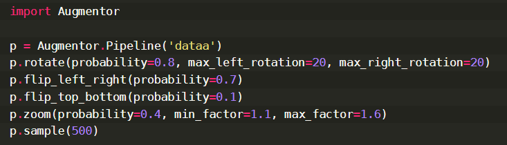

# Bag-of-words-project  

Aim of the project was to create system that is able to determine famous places in Poznań (bałtyk, katedra, okrąglak, teatr wielki, uam).  
If you would like data i've used write to me!  
Good theoretical explanation of bag of words you can find in [Wikipedia](https://en.wikipedia.org/wiki/Bag-of-words_model).  
Ilustration what bag of words is shown below:  
  

## My repository
**Data Augmentation:**  
We didn't have lot of data, so i decided to use data augmentation. From around 60 photos i made around 440 more and i could train my model with around 500 photos. Below you can see parameters i've used for augmentation:  
  
**Detector/Descriptor, Classificator and Vocab model:**
Main code you can find in *notebook_project.py*. I've used various of detector/descriptor e.g cv2.AKAZE_create(), cv2.ORB_create(), cv2.xfeatures2d.SIFT_create().
The best results i could get by using SIFT detector/descriptor. For classificator i've used svm.SVC(), and it's parameters choosed by applying GridSearch. Vocab model was typical KMeans algorithm with 150 clusters.

**Results:**
With vocab_mode.p and clf.p, the best result i got i shown below:  
```
> Results: 0.925   
```
 Remember that you can check what parameters my vocb_model.p and clf.p had with command:  
 ```
 with Path('clf.p').open('rb') as classifier_file:  # Don't change the path here
    clf = pickle.load(classifier_file)
print(clf)
 ```


